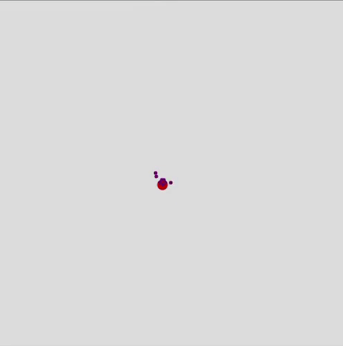

# Random Walk with p5.js

## This was a test project to create a simple version of the [Random Walk](https://en.wikipedia.org/wiki/Random_walk) using the [p5.js editor](https://editor.p5js.org/).

  

## To execute the random walk, just copy & paste the code from the sketch.js into the p5.js editor and run it.
